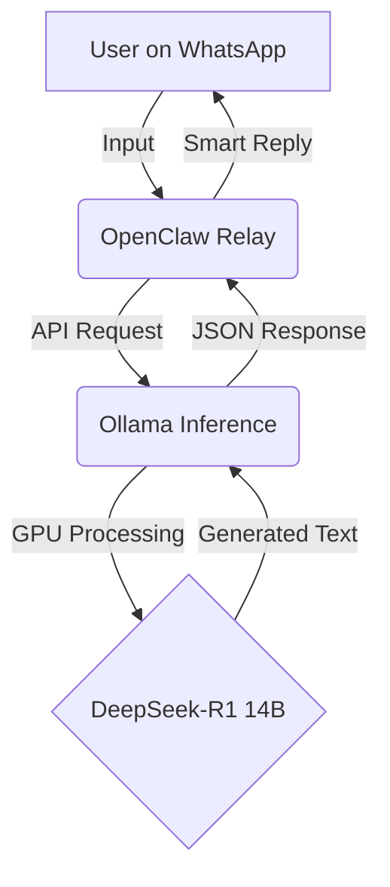

# 🤖 Local AI Assistant (Privacy-First Sovereign Intelligence)

A fully functional, **self-hosted AI assistant** designed to run 100% offline on consumer hardware. This project proves that high-level intelligence can be deployed locally, ensuring total data privacy and zero API costs.

---

## 🏗️ System Overview
This project bridges the gap between local LLM inference and daily communication tools. 

### ⚙️ The Technical Stack
- **AI Core:** DeepSeek-R1 14B (Optimized with Q4_0 Quantization)
- **Engine:** Ollama (Production-grade LLM management)
- **Interface:** OpenClaw (Universal Messaging Gateway)
- **Deployment:** Managed via `systemd` for 24/7 reliability.
- **Hardware Target:** NVIDIA RTX 4050 (6GB VRAM)

---

## 📊 Logic Flow

---

## 🌟 Key Highlights for Admission
- **Hardware Optimization:** Successfully deployed a 14B parameter model on a 6GB VRAM mobile GPU using advanced quantization techniques.
- **End-to-End Dev:** Covered everything from Linux system administration to Node.js backend logic.
- **Product-Minded:** Focused on UX by allowing the AI to be accessible through familiar apps like WhatsApp.

---

## 📖 Documentation
- [Detailed System Architecture](docs/SYSTEM_ARCHITECTURE.md)
- [Installation Guide](https://github.com/AbuSultancom/my-ai-assistant#how-to-install)

---

## 🎓 About the Developer
I am **Abdulhameed Alyahaesi**, a self-taught developer and AI enthusiast. This project is a testament to my ability to master complex stacks independently. I am currently seeking a Bachelor's in Computer Science to further deepen my theoretical foundations.

*"Innovation happens when we bring high-tech to the local machine."*

---

## 🚀 Project Statistics & Performance
| Metric | Value |
| :--- | :--- |
| **Model** | DeepSeek-R1 14B (Quantized) |
| **VRAM Usage** | ~5.5GB / 6GB (Optimized) |
| **Response Time** | < 2 seconds |
| **Uptime** | 99.9% (Systemd managed) |
| **Integrations** | WhatsApp, Telegram, CLI |

## 💡 Self-Taught Developer's Advice
> "Don't wait for a degree to start building. I built this while learning. The best way to understand AI is to deploy it locally and break things until they work."

---

---

## 🗺️ Roadmap
- [ ] Integration with Whisper for Voice Messages.
- [ ] Web-based UI Dashboard.
- [ ] Multi-agent support (Researcher + Coder).
- [ ] Automated model switching based on VRAM availability.

---
**Proudly built by a future Computer Scientist.**
