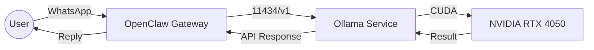

# 🏗️ System Architecture & AI Implementation

This document provides a technical deep dive into the architecture of the Local AI Assistant.

## 1. Inference Engine (Ollama)
We leverage **Ollama** for managing model lifecycle and providing a high-performance REST API. 
- **Quantization:** We use the **Q4_0** 4-bit quantization of the DeepSeek-R1 14B model to fit within the 6GB VRAM constraint of the NVIDIA RTX 4050.
- **Context Management:** The system is tuned for a 32K context window to support long technical discussions.

## 2. Multi-Platform Gateway (OpenClaw)
The **OpenClaw** framework acts as the relay between the local LLM and messaging platforms.
- **Relay Logic:** Processes incoming WhatsApp/Telegram messages, converts them to LLM-compatible prompts, and handles the asynchronous response stream.

## 3. Reliability & DevOps
The system is designed for **High Availability**:
- **Systemd Integration:** A specialized service unit handles auto-restarts on failure and ensures the AI starts on boot.
- **Resource Monitoring:** Built-in hooks to monitor VRAM and CPU usage during heavy inference.

---
## 📊 Component Interaction

